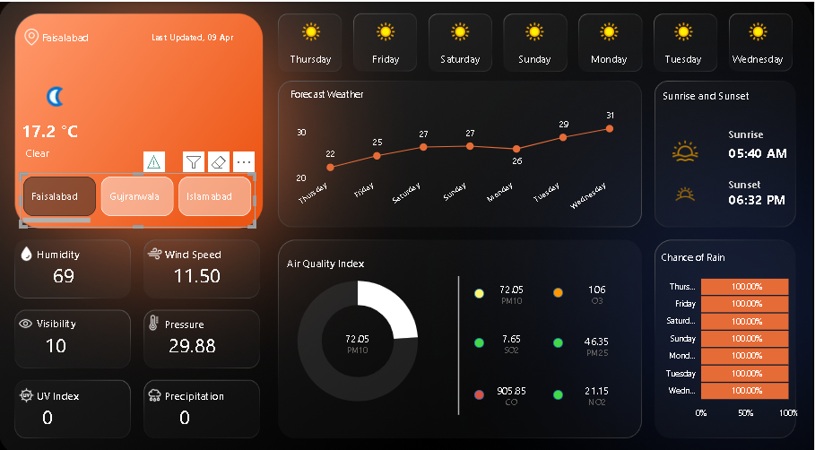

<h1>🌦️ Weather & Air Quality Dashboard (Power BI)</h1>

An interactive <b>Weather & Air Quality Dashboard</b> built using <b>Power BI</b> and <b>WeatherAPI</b>.
This project visualizes real-time weather data along with Air Quality Index (AQI) insights in a modern dashboard.

<h2>📌 Project Overview</h2>

<ul>
  <li>🌡️ Current temperature & weather conditions</li>
  <li>💨 Wind speed, humidity, pressure, visibility</li>
  <li>📅 Weekly weather forecast</li>
  <li>🌅 Sunrise & sunset timings</li>
  <li>🌧️ Chance of rain</li>
  <li>🌫️ Air Quality Index (PM10, PM2.5, CO, NO2, SO2, O3)</li>
  <li>🎨 Dynamic AQI color indicators</li>
</ul>

<h2>🛠️ Tools & Technologies</h2>

<ul>
  <li>Power BI Desktop</li>
  <li>WeatherAPI (REST API)</li>
  <li>Power Query</li>
  <li>DAX</li>
</ul>

<h2>🔑 Features</h2>

<ul>
  <li>🔄 Real-time API data integration</li>
  <li>📊 Interactive visuals</li>
  <li>🎨 Conditional formatting using DAX</li>
  <li>🌍 Multi-city selection</li>
  <li>📈 Forecast analysis</li>
</ul>

<h2>⚙️ How It Works</h2>

<h3>1️⃣ Get API Key</h3>

Sign up at WeatherAPI and generate your API key.

<h3>2️⃣ Connect Power BI to API</h3>

<pre>
https://api.weatherapi.com/v1/current.json?key=YOUR_API_KEY&q=CITY_NAME
</pre>

<h3>3️⃣ Data Transformation</h3>
<ul>
  <li>Expand JSON fields</li>
  <li>Extract weather & air quality data</li>
  <li>Clean and rename columns</li>
</ul>

<h3>4️⃣ Data Modeling</h3>
<ul>
  <li>Create relationships between tables</li>
  <li>Organize current and forecast data</li>
</ul>

<h3>5️⃣ DAX Example</h3>

<pre>
AQI_Color_PM10 =
VAR AQI = ROUND(SELECTEDVALUE('Current'[current.air_quality.pm10]), 0)
RETURN
SWITCH(
    TRUE(),
    AQI <= 50, "#43d946",
    AQI <= 100, "#fff570",
    AQI <= 150, "#ff9800",
    AQI <= 200, "#d99343",
    AQI <= 300, "#ff5b0f",
    "#d95243"
)
</pre>

<h2>📊 Dashboard Components</h2>

<ul>
  <li><b>Cards:</b> Temperature, humidity, wind speed</li>
  <li><b>Line Chart:</b> Weekly forecast</li>
  <li><b>Gauge:</b> Air Quality Index</li>
  <li><b>Bar Chart:</b> Chance of rain</li>
  <li><b>Slicers:</b> City selection</li>
</ul>

<h2>🎨 UI Design</h2>

<ul>
  <li>Dark theme modern layout</li>
  <li>Weather icons</li>
  <li>Clean and minimal design</li>
</ul>

<h2>📷 Dashboard Preview</h2>

<h2>🚀 How to Use</h2>

<ol>
  <li>Clone the repository</li>
  <li>Open the .pbix file</li>
  <li>Replace API key</li>
  <li>Refresh data</li>
  <li>Explore dashboard</li>
</ol>

<h2>📚 Learning Outcome</h2>

<ul>
  <li>API integration with Power BI</li>
  <li>Power Query transformations</li>
  <li>DAX measures</li>
  <li>Dashboard design</li>
</ul>

<h2>🙌 Acknowledgment</h2>

Based on tutorial: 
<a href="https://thedeveloperyt.com/how-to-develop-a-power-bi-dashboard-with-weatherapi/" target="_blank">
WeatherAPI Power BI Dashboard Tutorial
</a>

<h2>⭐ Support</h2>

If you like this project: 
⭐ Star the repo 
🍴 Fork it 
📢 Share it

